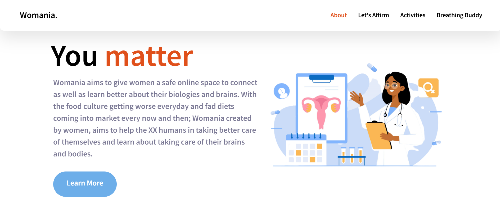
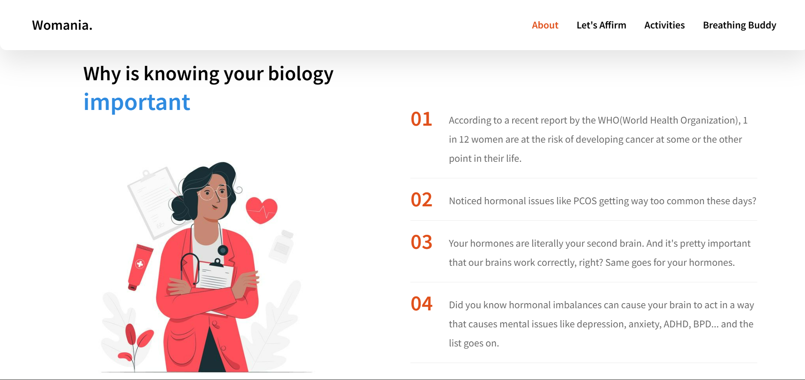
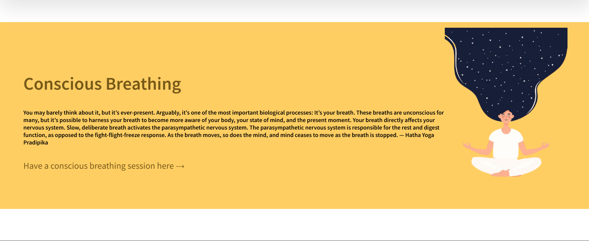
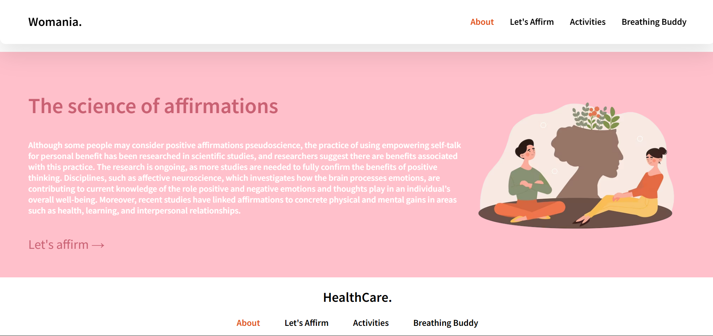
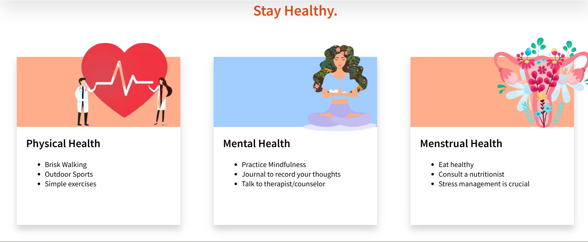

Womania

A women-centered health and wellness platform designed to educate, uplift, and support women through science-backed information, activities, breathing exercises, and affirmations.

🌍 Live Demo : https://womaniaforwomen.vercel.app/

📌 Description

Womania is a front-end web project built to provide a visually engaging and informative space where women can learn about hormonal health, physical well-being, mental wellness, and menstrual awareness. The design uses motion + content to build engagement, with scroll animations powered by AOS.

📸 Preview :

Landing Page

Pitch

Breathing App

Affirmations App

Stay Healthy cards

The site includes:

About section

Educational biological context

Physical/mental/menstrual health cards

Guided breathing exercise app

Affirmations page

Smooth navigation

📝 Key Sections
⭐ Landing Section

Core message: You matter.
Includes imagery + mission statement linking women’s biology, self-respect, and empowerment.

⭐ About Section

Real health statistics + biology explanation
→ why understanding hormones matters

⭐ Activities Section

Three health pillars:

Physical

Mental

Menstrual

Each with visible action items.

⭐ Breathing Buddy

A guided conscious breathing experience — linked to app.html.

⭐ Affirmation Science

Explains how positive affirmations affect brain + nervous system.
Links to affirm.html interactive page.

✨ Features

Responsive layout

Scroll animations

Clean section-based navigation

Educational content

Emotional wellness focus

Health action ideas

Static routing to breathing + affirm pages

🎨 Technologies Used

Frontend:

HTML

CSS

Libraries/Resources:

AOS.js (scroll animations)

Google Fonts

📂 Folder Structure (simplified)
womania/
│
├── index.html
├── styles.css
├── app.html
├── affirm.html
│
└── HealthiHer/
     └── img/
         ├── landingimg.png
         ├── impimg.jpeg
         ├── phyimg.png
         ├── mentalimg.png
         ├── mentrualimg.png
         ├── appimg.png
         └── ...

🚧 Future Enhancements

Add real health articles + references
Add user login + profiles
Add community forum
Add progress tracking
Add backend + database
Add dashboards for cycle tracking

📬 Contact

Creator: Saraswati Tiwari
Email + GitHub + LinkedIn to be added here